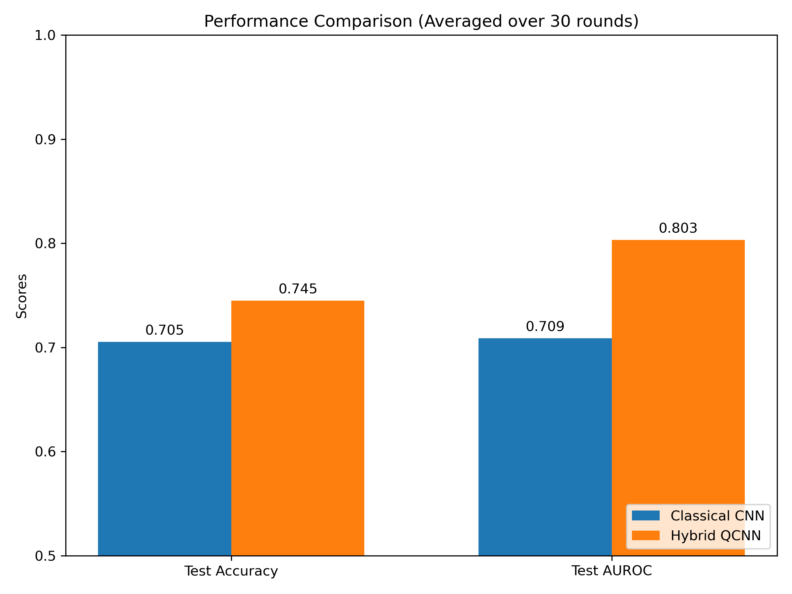

# Hybrid Quantum-Classical CNN for Pneumonia Detection

> **Official Reproduction of arXiv:2202.10452** > Reproduced by: **Sun Xiaopeng (孙啸鹏)**, AI Major at Jiangsu University of Science and Technology.

## 🌟 Project Overview
This project implements a hybrid neural network that integrates a **Variational Quantum Circuit (VQC)** into a classical CNN architecture for detecting pneumonia from chest X-ray images. 

## 🏗 Architecture
The core innovation is replacing the penultimate dense layer with a 2-qubit quantum layer. 
- **Quantum Layer**: 2 qubits, Angle Embedding ($R_x$), and 3 layers of alternating CNOT gates (as shown in Figure 3 of the paper).
- **Fair Comparison**: Both classical and hybrid models are constrained to the same number of trainable parameters (6) in the target layer.

## 📊 Benchmark Results (30 Rounds)
We conducted 30 independent training rounds to ensure statistical significance.

| Metric | Classical CNN | Hybrid QCNN | p-value |
| :--- | :--- | :--- | :--- |
| **Test AUROC** | 0.709 | **0.803** | **0.001** |
| **Test Accuracy** | 0.705 | **0.745** | **0.003** |

## 🚀 How to Run
1. **Environment**: `pip install -r requirements.txt`
2. **Data**: Download the dataset from [Kaggle](https://www.kaggle.com/paultimothymooney/chest-xray-pneumonia).
3. **Training**: Run `python full_30_rounds.py`
4. **Analysis**: Run `python Drawing.py`

## 📚 References
If you find this reproduction helpful, please cite the original paper:

> **Title**: A Classical-Quantum Convolutional Neural Network for Detecting Pneumonia from Chest Radiographs  
> **Authors**: Viraj Kulkarni, Sanjesh Pawale, Amit Kharat  
> **Source**: arXiv:2202.10452 (2022)  
> **Link**: [https://arxiv.org/abs/2202.10452](https://arxiv.org/abs/2202.10452)
